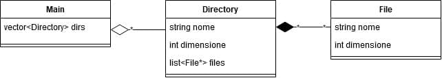

# Esame Prog. avanzata - 10/02/2020

## Teoria
1. Dopo aver brevemente introdotto i concetti di _lambda expression_ e _puntatore a funzione_, spiega qual è la loro relazione.
2. Spiega in che modo sono diverse l'ereditarietà di tipo `protected` e l'ereditarietà di tipo `private`, fornendo esempi di codice e implementazione.
3. Parla del concetto di  _rvalue reference_: cos'è, quando è stato introdotto e perché, facendo esplicito riferimento a come si inserisce nell'ambito della move semantics, con esempi di codice.
4. Parla della libreria _algorithm_, soffermandoti in particolare sul concetto di range e mostra un esempio di utilizzo con `std::list`.

## Pratica

5. Modella queste relazioni. Costruisci le classi con tutti i costruttori, distruttori e metodi che ritieni opportuni. A questo punto:
    * crea un metodo per la stampa di ogni classe tramite `cout` (le directory devono stampare le liste dei file);
    * crea nel main un vettore `dirs` di Directory e inserisci tre directories di nome `"DirA"`, `"DirB"` e `"DirC"`;
    * in ogni Directory inserisci tre File la cui dimensione deve stare nel range `[-500, 500]`;
    * lancia un'eccezione se la dimensione generata è negativa, ma assicurati che il programma non si blocchi; stampa l'eccezione se viene sollevata
    * stampa nel main il vettore ottenuto.
6. Crea una mappa `parcheggi` di `<string, int>` e popolala di tre elementi `"FIERA", 200`, `"FLAVIO", 250` e `"FLUENTE", 200`. Crea una funzione `StampaOrdineDEC` che stampi questi elementi in ordine decrescente secondo il numero di posti (si consiglia l'utilizzo di una struttura di supporto); se due parcheggi hanno lo stesso numero di posti non è necessario fare ulteriori elucubrazioni su quale stampare prima, qualsiasi ordine andrà bene.
7. Crea un `vector<int> dato` di 10 elementi e popolalo di valori compresi tra 0 e 10 usando la funzione `generate` della libreria algorithm. A questo punto:
    * crea due funzioni `setPari` e `setDispari` che prendano in input il vettore nel modo opportuno; la prima deve settare a 1 i valori pari e la seconda deve settare a 0 i valori dispari;
    * crea due thread e usali per lanciare le due funzioni appena create;
    * prendi le misure opportune per prevenire il data race.
