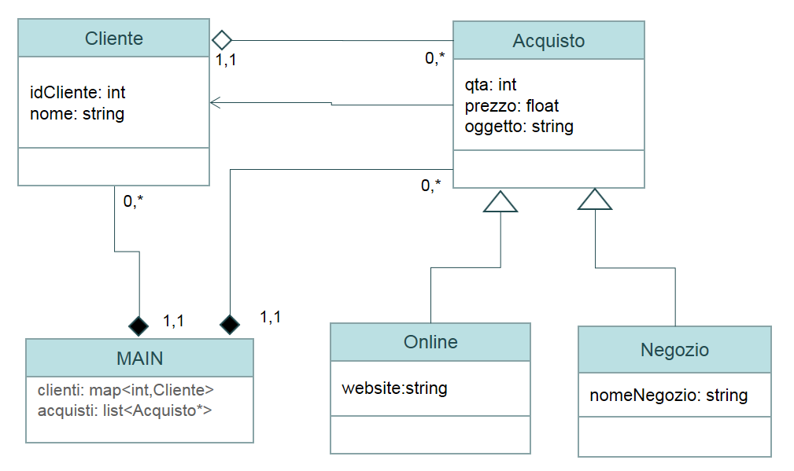

# Esame Prog. avanzata - 21/01/2022

Questo esame si è svolto online ed era dedicato agli studenti che non hanno potuto svolgere l'esame in presenza per cause covid.
L'esame era suddiviso in due parti: parte pratica (60 minuti) e orale (30 minuti). 

## Teoria
1. Differenza tra copia superficiale e profonda.
2. Spiegare cosa succede quando eredito con visibilità private e proteced con esempi.
3. Differenza tra ridefinire il costruttore di copia profonda e move semantics con esempio.
4. Spiegare l'utilizzo della keyword virtual.
5. Rimplementare il metodo di assegnamento con copia profonda e move semantics.
6. Parla della ereditarietà multipla con esempio.

## Pratica

5. Definire tutte le classi presenti nell’UML seguente in files separati, per ogni classe aggiungere gli attributi definiti in figura, costruttori specifici, distruttori, più altri metodi / attributi ritenuti necessari per realizzare le relazioni. NON è possibile definire una funzione di stampa, ridefinire l’operatore << per tutte le classi
  
6. Nel main dichiarare le variabili come da UML e
 - aggiungere alla variabile clienti i seguenti elementi: id 1, nome “Marco” id 2, nome “Lucia” id 3, nome “Luca”
 - aggiungere alla variabile acquisti 6 elementi scelti casualmente tra Online e Negozio. Inizializzando i valori tramite una funzione InitDato
 - la funzione InitDato riceve un valore che permette di sapere se deve essere restituito un’istanza di tipo Online o Negozio. Gli attributi website e nomeNegozio devono essere inseriti da tastiera). L’attributo qta deve essere inizializzato tramite un numero casuale tra 1 e 9 e prezzo deve essere letto da tastiera. Generare casualmente un id compreso tra 1 e 5 per identificare il cliente a cui attribuire l’acquisto. Lanciare una opportuna eccezione che ogni qual volta il valore di id non corrisponde ad un elemento presente nel map clienti. L’eccezione sollevata non deve bloccare l’esecuzione del programma (aggiungere metodi specifici nelle classi).
  
7. Scrivere una funzione chiamata sommaPrezzi che possa essere richiamata dalla funzione accumulate per sommare gli attributi prezzo presenti nelle istanze della variabile acquisti. Nel main stampare il risultato di tale invocazione.

8. Nel main lanciare 2 processi paralleli (Thread) che invochino in modo opportuno le due funzioni: rimuoviDispasri e incPari
 - creare una funzione qtaPari a cui passare in modo opportuno la variabile acquisti, dove tramite una espressione lambda tutti il prezzo relativo a delle qta pari vengano raddoppiati.
 - creare una funzione qtaDispari a cui passare in modo opportuno la variabile acquisti, dove tramite una espressione lambda tutti il prezzo relativo a delle qta dispari vengano dimezzati.

9. Stampare il contenuto della variabile clienti attraverso l’invocazione dell’operatore <<

(NOTA: la stampa deve prevedere anche la stampa delle informazioni degli acquisti collegati)
