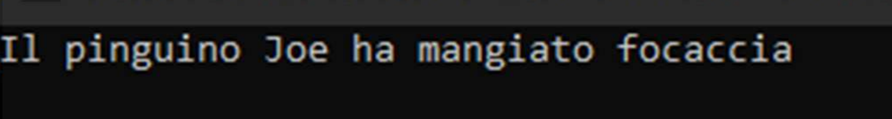

# Simulazione Prog. avanzata - 02
## Teoria
1. Descrivi ampiamente il concetto di copia profonda; illustra poi un breve esempio in cui è presente una classe per cui ha senso creare il costruttore di copia profonda e crea anche tutti i metodi che si rendono necessari (utilizzare pseudocodice se diventa troppo lunga).
2. Cos'è la programmazione generica? Come si usa e quali problemi risolve? Produci un esempio creando una funzione generica `somma…(T t1, T t2)` (assumi che l’operatore `+` sia già definito come metodo per la classe `T`).
3. Spiega tutto quello che sai sul contenitore `Set` della STL. Quale operatore deve essere definito per creare un set di elementi di una certa classe? Perché?
4. Cos'è un move constructor? Cosa lo rende diverso da un copy constructor? Fa' un esempio di implementazione di copy constructor e di move constructor per una classe `A` che contiene un intero ed una stringa e che ha già implementato il costruttore `A(int _n, string _s){ … }`

## Pratica
5. Crea un vettore di interi positivi e negativi, inizializzalo random con 20 numeri nel range [-50, +50]. Utilizza poi le funzioni della libreria algorithm e stampa i seguenti risultati (stampa `true` se la condizione è verificata, `false` altrimenti):
   * se il vettore contiene almeno un positivo;
   * se il vettore contiene solo positivi;
   * se il vettore non contiene alcun positivo;
   * se nei primi 3 valori del vettore c'è almeno un positivo
6. Crea una classe `Pinguino` che deve avere gli attributi numero di zampe, età e nome, in seguito sovrascrivi i metodi di tale classe in modo da ottenere che:
   * se sommi due pinguini ottieni un terzo pinguino con età 0 e numero di zampe la somma delle zampe dei genitori;
   * un pinguino con più zampe è maggiore di un pinguino con meno zampe;
   * il preincremento ed il postincremento funzionano come per gli interi, ritornano un pinguino e ne aumentano il numero di zampe;
   * un pinguino deve poter essere usato come funzione che ritorna `void` e prende come input una stringa cibo; la funzione deve stampare a video una cosa come:
7. Crea un bitset di 64 bits, poi:
   * inizializzalo con una stringa;
   * stampalo;
   * shiftalo a sinistra di 4 posizioni;
   * interpretarlo come un `long long` e stampa a quale intero corrisponde;
   * resetta il bit 17;
   * flippa tutti i bit e stampalo.
8. Crea una lista di stringhe, tale lista deve contenere 5 nomi di persone, poi esegui le seguenti operazioni, curandoti di stampare la lista alla fine di ciascuna:
   * inserisci nella lista due Paolo e 3 Giovanni in posizioni casuali (create con `rand()`);
   * usando funzioni di algorithm ruota la lista nelle posizioni [0-7] usando come perno (middle) la posizione 3 ;
   * rimpiazza tutti i Paolo con Franco;
   * rimuovi tutti i Franchi che trovi nelle prime 6 posizioni;
   * usando una lambda stampa tutti i nomi con lunghezza minore o uguale a 5.