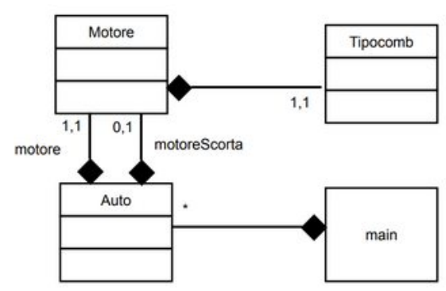

# Simulazione Prog. avanzata - 03
## Parte teorica
1. Spiega tutto quello che sai sulle _lambda expressions_, fornendo esempi di dichiarazione e uso; in quanti modi possiamo catturare una variabile? Possiamo modificarla? E se volessimo specificare il tipo di ritorno, potremmo?
2. Move semantics: descrivi i concetti di _lvalue_ e _rvalue_ e _lvalue reference_ e _rvalue reference_; per tutti questi produci esempi d'uso, ma soffermati in particolare sugli ultimi e approfondisci ulteriormente le motivazioni che soggiacciono alla loro introduzione. 
3. Template Metaprogramming: parlane, liberamente, senza censura.
4. Pillola rossa, `std::vector<>`, pillola blu, `std::list<>`: rigurgita sul foglio lo stream of consciousness che attraversa la tua mente quando vieni messo di fronte a questa scelta.
## Parte pratica
5. È finalmente giunta la tua occasione: grazie alla buona parola messa dallo zio in giunta regionale, sei finalmente stato incaricato di mettere mano e rimodernare il sito dell'organo legislativo italiano. Di lavoro da fare sicuramente non ne manca ([qui](http://www.parlamento.it/home) se vuoi farti un'idea), ma la cosa che ti preme maggiormente fare è modellare queste relazioni in `C++`:
   * Il parlamento è fatto di Persone; tutte queste sono dei Parlamentari; alcune Persone, esterne al parlamento, sono dei Ministri, ma naturalmente anche alcuni Parlamentari sono anche Ministri;
   * Il Governo ha un certo numero di Ministri e un certo altro numero di Parlamentari. Questi Ministri, ovviamente, cessano di essere tali nel momento in cui il Governo cade; diversamente, i Parlamentari sopravvivono alla caduta del Governo. Schemino per chiarezza: 
6. Prepara una lista di caratteri, inizializzala con $8$ delle lettere minuscole casuali e prepara aperta la pagina di reference per la libreria `algorithm`:
   * verifica se tutti i caratteri nella lista sono compresi nell'intervallo `a-m`;
   * verifica se c'è almeno un'occorrenza di `x`, `y` o `z`;
   * verifica se c'è almeno un'occorrenza di lettere uguali adiacenti; in caso affermativo, rimuovile;
   * verifica se la stringa formata dalla concatenazione di questi caratteri è una permutazione della stringa `"bucefalo"`.
7. Hai la classe `A` che è povera e possiede solamente un `int i` e un `B* bp`; rallegrale la giornata donandole un costruttore a un parametro e una ridefinizione degli operatori `+`, `-`, `++` preincremento, `++` postincremento, `=` (deep copy + move).
8. You know what to do: 
