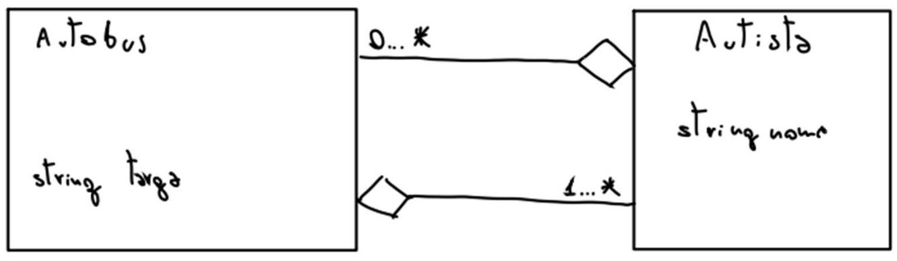

# Simulazione Prog. avanzata - 05
## Teoria
1. Ereditarietà: parlami approfonditamente di questo meccanismo e di come è implementato nel `C++`. Spiega in che modi una classe può ereditare da un’altra e cosa questo comporta. 
2. Esiste un modo per passare un rvalue per riferimento che non preveda l’utilizzo della `&&`? Mentre pensi a questa risposta racconta cos’è un rvalue e perché è differente da un lvalue.
3. Cosa sono gli iteratori, dove sono stati introdotti e perché? Scrivi un esempio di funzione di stampa e commenta l’uso degli iteratori (i vari tipi possibili) al suo interno. 
4. Parlami del multithreading: cos’è, vantaggi e possibili problemi. 

## Pratica
5. Crea una classe `Cassetto`. Questa classe come attributo privato ha un insieme; questo insieme potrebbe essere di calzini o anche di posate, insomma, dato che non sai cosa metterai nel cassetto, crea l’insieme come contenitore di un tipo generico. Poi crea un metodo per istanziare il cassetto e uno per aggiungere roba nel cassetto. Una volta terminato assicurati che il cassetto sia stampabile con `cout` e che la stampa vada a printare l’intero set.
   
   La parte finale dell’esercizio consta nell’istanziare effettivamente un cassetto e riempirlo di rimpianti (crea una classe `Rimpianto` con attributo intero dolore e fa in modo che possa essere messa in un cassetto).
6. Dichiara una classe `Stampella { … }` che contiene un intero privato `n` inizializzabile tramite costruttore dedicato. Tale classe deve essere invocabile come funzione con tipo di ritorno `void` e che stampi n volte la parola `"hop"`; a questo punto crea per stampella un metodo saltello che prenda come parametro un intero `x` e stampi la parola `"hip"` (`x*n`) volte. Nel main crea due stampelle e due thread: il primo thread deve eseguire la prima istanza di stampella come funzione, il secondo thread deve invece eseguire il metodo saltella della seconda istanza di stampella.

    Se sei arrivato a questo punto verosimilmente mi odierai abbastanza, ma io intendo continuare imperterrito a farti richieste complesse: voglio che hip e hop vengano chiamati in ordine, prima tutti gli hop e poi tutti gli hip. 

7. Crea una classe `Tesoro{…}` che ha come attributo un `int` privato valore, crea un costruttore a un parametro per inizializzare tesoro. Nel main crea una map `mappa<string, Tesoro>` e buttaci dentro 5 tesori, ma non usare il metodo insert di map per farlo. Itera poi su tutta la mappa con una funzione di algorithm e stampa tutti i tesori della lista (stampa stringa e valore del tesoro associato). 
8. Crea due classi `Autobus` e `Autista`, inserisci gli attributi rispettivamente targa e nome (stringhe). Scrivi i costruttori adeguati, tenendo conto delle proprietà di aggregazione o composizione specificate. Crea i metodi per aggiungere Autobus agli Autisti o viceversa (naturalmente dovrai creare delle liste come attributi). Infine crea un metodo per la stampa in cout di entrambe le classe, tenendo conto che se stampo un autista voglio solo il suo nome mentre se stampo un autobus voglio la sua targa ed il nome degli autisti che lo guidano. 

    